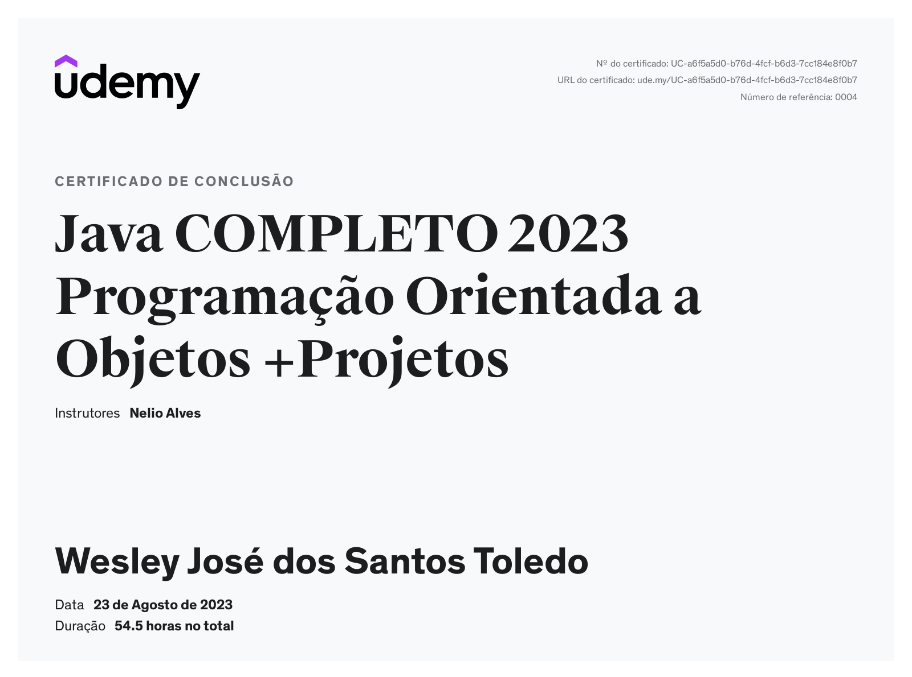

<h1 align="center"> Java Completo com Programação Orientada a Objetos e Projetos </h1>

<h2>Tecnologias</h2>

- Java
- OO
- UML
- JDBC
- JavaFX
- Spring Boot
- JPA
- Hibernate
- MySQL
- MongoDB
- Git/Github

